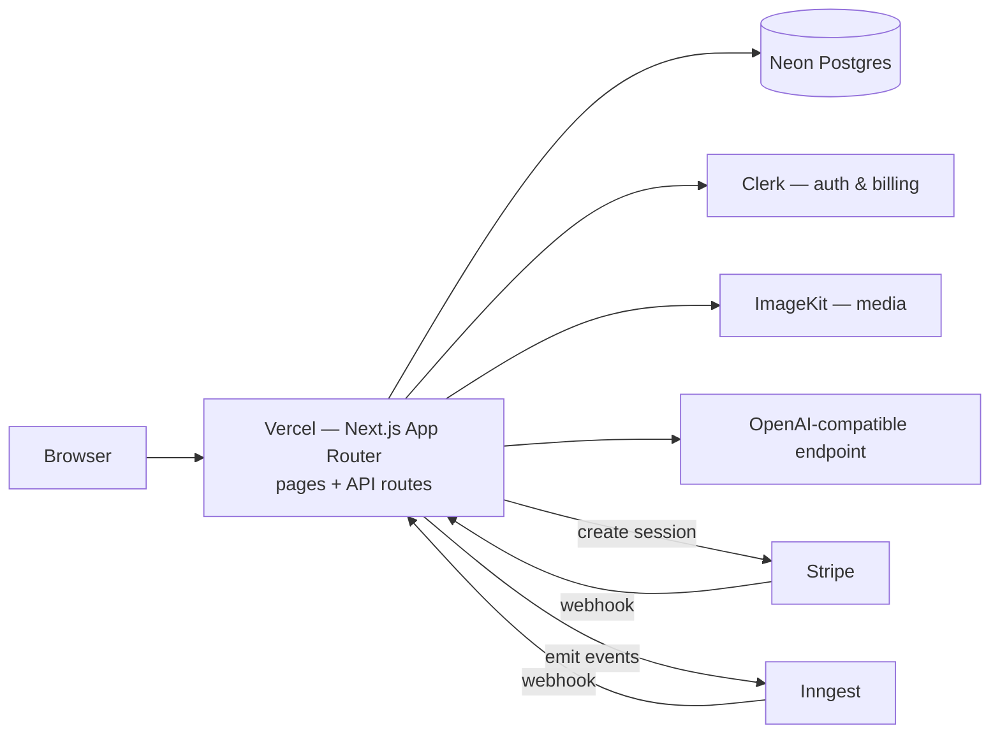
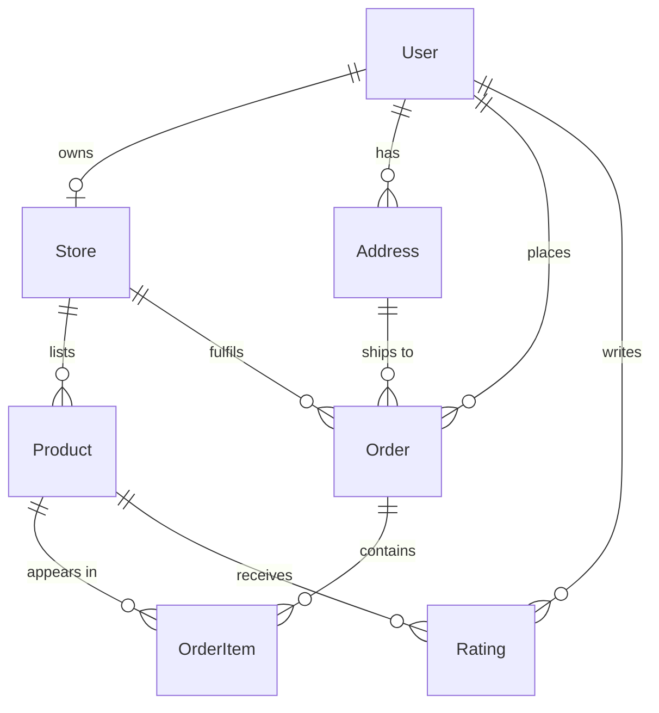
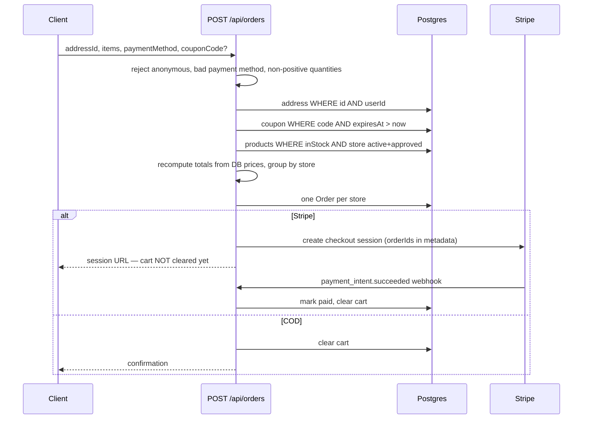

# Architecture

GoCart is a multi-vendor marketplace: many independent sellers list products in
one storefront, a buyer's basket can span several sellers, and an administrator
gates which sellers go live.

## System

One deployable unit. Pages and API routes ship together; everything else is a
managed service.

## Route groups

| Path | Audience | Gate |
| --- | --- | --- |
| `app/(public)/*` | Shoppers | Public. A Clerk session unlocks cart, orders, checkout. |
| `app/store/*` | Sellers | `middlewares/authSeller` — must own an **approved** store |
| `app/admin/*` | Admins | `middlewares/authAdmin` — email must appear in `ADMIN_EMAIL` |
| `app/api/*` | — | The only layer that touches the database |

`middleware.js` runs `clerkMiddleware()` to attach the session. It does **not**
authorize; every route handler checks for itself. That keeps authorization
decisions next to the data access they protect.

## Data model

`Coupon` and `ProcessedWebhookEvent` stand alone — neither has foreign keys.

A `User` row mirrors a Clerk account and is created asynchronously by the
Inngest `clerk/user.created` handler, so it can briefly lag a first sign-in.
Code that reads it treats absence as normal rather than as an error.

## Checkout

Three properties this flow guarantees:

- **Prices come from the database.** The client sends product ids and
  quantities; unit prices are never trusted from the request.
- **A basket splits per seller.** One `Order` per store, so each seller sees and
  fulfils only their own line items. Shipping is charged once across the basket.
- **A Stripe cart is cleared by the webhook, not the request.** The order exists
  as unpaid until Stripe confirms, so an abandoned checkout leaves no phantom
  paid order.

## Design decisions

**No separate backend service.** Next.js route handlers serve 21 endpoints with
no external consumers. A standalone API would add a second deployment, CORS, and
duplicated types to solve a scaling problem this project does not have.

**Clerk over a hand-rolled auth system.** Sessions, user management, and the
`plus` membership plan behind `<Protect>` come as one dependency. Rebuilding
that would cost days and demo worse.

**Authorization helpers never return `undefined`.** `authSeller` returns a store
id or `false`. This matters because Prisma **silently drops `undefined` from a
`where` clause** — `findMany({ where: { storeId: undefined } })` returns *every*
row rather than none. An earlier version fell through to `undefined` for
non-approved stores, which turned the seller dashboard into a full platform data
leak. The invariant is enforced by a test asserting the helper never resolves to
`undefined`.

**Webhook handling is idempotent by ledger.** Stripe retries deliveries and
events can be replayed. Each event id is inserted into `ProcessedWebhookEvent`
*before* any mutation; a unique-constraint violation short-circuits the request.
Cancellation deletes only orders where `isPaid` is false, so an out-of-order
`canceled` delivery cannot destroy a paid order.

**Redux Toolkit for cart state.** The cart must survive navigation and sync to
the server on a debounce. The store is created per request in `StoreProvider`
via `useRef`, so server-rendered requests never share state.

**Admin identity lives in an environment variable.** `ADMIN_EMAIL` is a
comma-separated allowlist. At one operator this is the right amount of
machinery; a roles table would be ceremony without benefit.

## Testing

Two entry points, both free of database, network and credentials:

- `tests/unit_tests.test.js` — modules in isolation, with Prisma, Clerk and
  axios mocked.
- `tests/integration_tests.test.js` — only external boundaries mocked; the real
  middleware and route handlers execute, so wiring is genuinely exercised.

Tests were validated by mutation: each fixed defect was reintroduced and the
suite confirmed to fail. Passing tests prove nothing until they have been
watched to fail.

## Known limitations

- No rate limiting. Fine behind a demo deployment; would be required for real traffic.
- Seller payouts are out of scope — Stripe collects into one account, and there
  is no Connect integration.
- Admin identity is environment-based, so changing administrators needs a redeploy.
- No component or end-to-end browser tests; UI is covered by build and review only.
